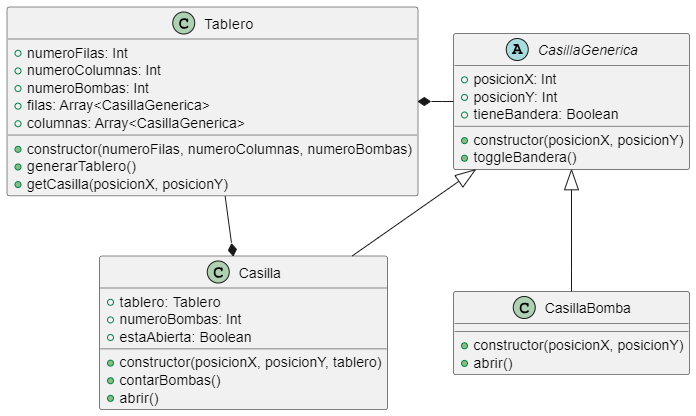
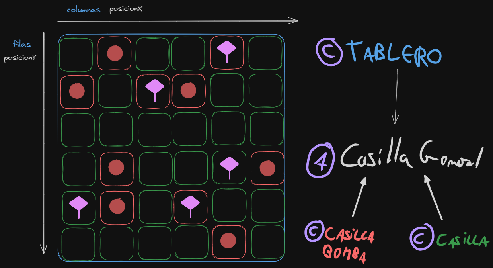

# Pr03 - BuscaMinas

## Diagrama de clases



## Descripción de las clases

### Clase Tablero

La clase Tablero es la clase principal. Tiene un número de filas, un número de columnas y un número de bombas.

#### Métodos

```javascript
constructor(numeroFilas, numeroColumnas, numeroBombas)
```

El constructor de la clase Tablero recibe el número de filas, el número de columnas y el número de bombas. A partir de estos parámetros se generará el tablero.

```javascript
generarTablero()
```

El método generarTablero() genera el tablero con las casillas y bombas que tenga el Tablero.

```javascript
getCasilla(posicionX, posicionY)
```

El método getCasilla() devuelve la casilla que se encuentra en la posición que se le pasa por parámetros.

### Clase CasillaGenerica

La clase CasillaGenerica es una clase abstracta que tiene una posición, un booleano que indica si la casilla está marcada o no.

#### Métodos

```javascript
constructor(posicionX, posicionY)
```

El constructor de la clase CasillaGenerica recibe la posición en X y la posición en Y de la casilla. Es decir, que recibe en qué fila y columna se encuentra.

```javascript
toggleBandera()
```

El método toggleBandera() cambia el valor del booleano que indica si la casilla está marcada o no.

### Clase Casilla

La clase Casilla hereda de la clase CasillaGenerica. Esta tiene el número de bombas adyacentes que tiene la casilla, el tablero al que pertenece y un booleano para saber si la casilla está abierta o no.

#### Métodos

```javascript
constructor(posicionX, posicionY, tablero)
```

El constructor de la clase Casilla recibe la posición en X, la posición en Y y el tablero al que pertenece.

```javascript
contarBombas()
```

El método contarBombas() cuenta el número de bombas adyacentes que tiene la casilla y lo guarda en el atributo correspondiente.

```javascript
abrir()
```

El método abrir() abre la casilla (y sus adyacentes si fuese posible) y revisa si el usuario ha ganado o no.

### Clase CasillaBomba

La clase CasillaBomba hereda de la clase CasillaGenerica.

#### Métodos

```javascript
constructor(posicionX, posicionY)
```

El constructor de la clase CasillaBomba recibe la posición en X y la posición en Y de la casilla.

```javascript
abrir()
```

El método abrir() abre la casilla e indica al usuario que ha perdido. El juego finalizaría aquí.


